# Credentials and Secrets

Authoritative data: [`data/credential-manifest.json`](<./data/credential-manifest.json>)

This document describes the secret management model for kg-automation: what
credentials exist, where they live, who manages them, and which consumers use
them. For expiry policies and review cadences, see the manifest.

---

## Storage Mechanisms

kg-automation uses eight distinct secret storage mechanisms. Each credential
uses the mechanism appropriate to the tool that owns or consumes it. There is
no single unified secret store — that is a deliberate trade-off favoring
simplicity on a Tailscale-gated personal server.

### 1. Tool-native auth store (gog)

Used by: `google-workspace-client`, `gog-keyring-password`,
`gog-credentials-keyring` (active). `personal-google` (deprecated; see
"Deprecated credentials" below).

> **Scope note (#699):** `gog` no longer owns the **Calendar** surface. As of
> #699 (RFC #681 calendar phase), Felix's calendar access uses its own
> per-account OAuth store (`felix-google-personal-calendar`, §8 below) read
> directly by the Felix calendar helper. `gog` retains Gmail, Drive, Contacts,
> Sheets, and Docs; it is not retired.

`gog` (the Google Workspace CLI, installed via Linuxbrew tap
`steipete/tap/gogcli`) manages its own OAuth2 token store via
`gog auth credentials` and `gog auth add`. Felix's Google Workspace
integration (Gmail, Calendar, Drive, Contacts, Sheets, Docs) consolidates
on this CLI as of 2026-05-13 (ADR-0001).

Three files participate:

1. `google-workspace-client` — OAuth Desktop `client_secret.json`
   downloaded from the Google Cloud Console. Read once by
   `gog auth credentials` at setup time. Stored at
   `/data/services/openclaw/secrets/google-workspace-client.json` (mode 600,
   claude:felix).
2. `gog-keyring-password` — random passphrase used by gog's encrypted file
   keyring backend. Required because office2 is headless (no D-Bus
   SecretService). Exported as `GOG_KEYRING_PASSWORD` in claude's
   `~/.bashrc`. Stored at `/data/services/openclaw/secrets/gog-keyring-password`
   (mode 600, claude:felix).
3. `gog-credentials-keyring` — gog-managed encrypted bucket holding the
   OAuth refresh tokens. Located at
   `/home/claude/.config/gogcli/credentials.json` (mode 600, claude:claude).
   **Not read or written directly** — only via `gog auth *` commands.

Felix agents do not handle any of these files directly. They shell out to
`gog` and the CLI handles token refresh, scope checks, and encryption
internally. See [`docs/runbooks/google-workspace-ops.md`](<../../runbooks/google-workspace-ops.md>)
for the full setup and operator procedure.

### 2. OpenClaw native auth

Used by: `anthropic`, `whatsapp-session`

OpenClaw manages these internally. The Anthropic API key lives in
`/home/claude/.openclaw/agents/main/agent/auth-profiles.json`. The
WhatsApp session is managed by OpenClaw's Baileys integration in
`~/.openclaw/credentials/whatsapp/`. Neither is touched directly —
OpenClaw handles auth refresh and session management.

### 3. Scoped plaintext files (mode 600)

Used by: `vikunja-api`, `vikunja-api-kent`

OpenClaw skills read credentials at runtime via `cat /data/services/openclaw/secrets/<name>`.
Files are owned by the `claude` user, mode 600. This pattern is appropriate
for API tokens consumed by skills via `exec` calls. It is not used for
credentials that have their own native management mechanism.

**`vikunja-api-kent` (#715, promoted by ADR-0007) — the sole runtime Vikunja
token.** As of [ADR-0007](<./adr/0007-retire-vikunja-felix-bot.md>) (#860 phase
2, 2026-07-23) this all-permissions token, owned by the `kent` Vikunja user, is
the **single runtime Vikunja credential**. Every runtime Felix→Vikunja consumer
— task reads/writes, completion writes, inbox scan/apply, sync full-poll,
escalation/enrichment, credential-health writer, and the config/label work it
was originally added for (#715) — resolves this token through one point,
`scripts/common/vikunja_config.get_vikunja_token_path()` (directly or via the
shared `VikunjaClient` default). It lives in the §3 scoped-plaintext slot at
`/data/services/openclaw/secrets/vikunja-api-kent` (mode 600, claude:claude).
See [`identity-model.md` §Agent Service Accounts](<./identity-model.md#agent-service-accounts>)
for the identity model.

**Why the consolidation.** Vikunja scopes objects (projects, labels, saved
filters, label attachment) **per user**. The former `felix-bot` runtime token
was blind to projects it was never shared into (topic projects 16–20, the #860
blind-read) and could not attach `kent`-owned labels (HTTP 403, #750). #715 had
already reintroduced this kent token for config/label work; #860 showed the read
side must also be `kent`; so ADR-0007 dropped the last reason to keep `felix-bot`
in the runtime path (task-write attribution) and collapsed everything onto
`kent`. The accepted cost: runtime writes attribute to `kent`, so `created_by`
no longer distinguishes agent from human on Vikunja (the `[Felix]` comment-text
convention remains that marker). Runtime and the #748 `validate_refs` drift
validator now share the `kent` view and cannot silently diverge (FR-005).

**`vikunja-api` (felix-bot) — retired to dormant (non-runtime).** The former
`felix-bot` token (owned by the dedicated `felix-bot` Vikunja user, #304 /
ADR-0002 Phase 1) is **retired from the runtime path** by ADR-0007 and marked
`status: retired` in [`credential-manifest.json`](<./data/credential-manifest.json>).
It is **dormant, not deleted**: the `felix-bot` Vikunja user remains (its
`created_by: felix-bot` history on existing tasks is preserved and it still owns
its private Inbox project 14), and the secret file
`/data/services/openclaw/secrets/vikunja-api` stays on office2 — but **no
runtime consumer resolves it**. Full deprovision of the user and reassignment of
Inbox(14) are **out of scope** (deferred cleanup; spec C-002). The GitHub
`kg-felix-bot` identity is a separate surface and is **unaffected** (spec C-003).
Historical provisioning/rotation detail: [`docs/runbooks/felix-bot-vikunja-provisioning.md`](<../../runbooks/felix-bot-vikunja-provisioning.md>).

### 4. System-managed or standalone tool

Used by: `restic-password`, `tailscale-auth`, `vikunja-admin`

These credentials are owned and managed by their respective tools (Restic,
Tailscale daemon, Vikunja's login endpoint). Neither OpenClaw nor agents
interact with them directly.

### 5. gh CLI auth store

Used by: `kg-felix-bot-pat`, `kentonium3-gh-oauth`

The GitHub CLI (`gh`) stores authentication tokens in two locations
depending on host:

- **office2** (claude user) — `/home/claude/.config/gh/hosts.yml` holds the
  `kg-felix-bot-pat` classic PAT. Felix agents shell out to `gh` and
  `git push` and transparently use this token. See
  [`identity-model.md` §Agent Service Accounts](<./identity-model.md#agent-service-accounts>)
  for the identity model.
- **Mac** (Kent's user) — macOS Keychain (managed by `gh` CLI) holds the
  `kentonium3-gh-oauth` OAuth app token (issued by GitHub CLI's web-flow
  login). Used for Kent's manual git operations and `gh` CLI invocations.

The two tokens are distinct identities; office2 never holds a copy of
`kentonium3-gh-oauth` and Mac never holds `kg-felix-bot-pat`.

### 6. systemd `EnvironmentFile` injection

Used by: `openclaw-gateway-env`, `felix-deployer-ntfy-topic`

Plain `KEY=VALUE` env-files consumed by systemd `EnvironmentFile=` directives
in drop-in configs under `~/.config/systemd/user/<service>.service.d/`. The
file lives at `/data/services/openclaw/secrets/openclaw-gateway.env` (mode
0600, claude:claude) and injects `GOG_KEYRING_BACKEND`, `GOG_KEYRING_PASSWORD`,
and `VIKUNJA_BASE_URL` into the `openclaw-gateway.service` process and all
child agent sessions it spawns. (`VIKUNJA_BASE_URL` added by #520 — resolves the
base URL for `vikunja_config.py` consumers in systemd context where `~/.bashrc`
is not sourced.)

This mechanism exists because systemd-launched services do not source
`~/.bashrc`, so the interactive-shell `export GOG_KEYRING_PASSWORD=…` in
claude's bashrc never reaches the gateway or its child agent sessions. The
env-file is a duplicate of `gog-keyring-password`'s contents in a format
systemd can consume directly. If `gog-keyring-password` rotates, this file
must be regenerated to match — see
[`google-workspace-ops.md` §Pitfall 4](<../../runbooks/google-workspace-ops.md>)
for the full operational context and the regeneration command.

The mechanism is distinct from §3 (scoped plaintext files read by skills via
`cat`) and from §1 (gog's own auth store) — it specifically bridges the
systemd-services-don't-see-bashrc gap.

`felix-deployer-ntfy-topic` (added by #595) uses the same mechanism via
`EnvironmentFile=-/home/claude/.config/felix-deployer/env` (leading-dash form;
non-fatal if the file is missing). The file carries `FELIX_DEPLOYER_NTFY_TOPIC`
— a private ntfy.sh topic identifier consumed by
`scripts/deploy/felix-deployer/notify.py` for failure notifications.
Mode 0640. Provisioned out-of-band on office2; template at
[`scripts/deploy/felix-deployer/env.sample`](<../../../scripts/deploy/felix-deployer/env.sample>).
Publish-only secret: knowing the topic enables passive listening to failure
alerts but cannot be used to impersonate the service.

### 7. GitHub Actions secret storage

Used by: `kg-felix-bot-project-sync-pat`

GitHub Actions native secret storage on `kentonium3/kg-automation`. The token
is exposed to workflow steps via `${{ secrets.PROJECT_SYNC_PAT }}` and never
appears on office2 or any operator-controlled host. Used exclusively by the
`priority-field-sync` job in `.github/workflows/spec-lifecycle.yml` (#523) to
mirror issue priority labels (`P1-*` / `P2-*` / `P3-*`) onto the Felix Roadmap
user-owned project's `Priority` single-select field. The token is held by the
`kg-felix-bot` identity, with `scope=project` only — narrower than
`kg-felix-bot-pat` (`repo, read:org, workflow`) to keep blast radius low if
either credential leaks.

This mechanism is distinct from §5 (gh CLI auth store, used by operator and
agent CLI shell-outs) because Actions workflows never invoke `gh` against the
project; they call the GraphQL API directly with `actions/github-script@v8`.

### 8. Per-account Felix Google OAuth store (calendar helper)

Used by: `felix-google-personal-calendar`

Introduced by #699 (RFC #681 calendar phase). Felix's own Google Calendar
helper (`scripts/google/calendar_helper.py`, via `scripts/google/calendar_auth.py`)
holds an **authorized-user OAuth2** credential per account in a canonical
per-account directory, independent of gog:

- `~/.config/felix/google/<account>/client_secret.json` — Desktop OAuth
  client from GCP project `felix-personal` (External, "In production").
- `~/.config/felix/google/<account>/token.json` — authorized-user token
  including the `refresh_token`. Minted once interactively on the Mac with the
  final `calendar.events` scope, then durable per RFC #681, and auto-refreshed
  in place by the helper.

Files are mode `0600` inside a mode `0700` per-account directory (on office2:
`/home/claude/.config/felix/google/personal/`). The base directory is
overridable via `FELIX_GOOGLE_DIR` for test isolation. The default account is
`personal` (`kentgale@gmail.com`); **adding a second account** (e.g.
`intentional.biz`) is create its directory + drop its credentials + pass its
account name — **no helper code change**.

This store is deliberately **separate** from gog's auth store (§1): the helper
talks to the Google Calendar API directly via `google-api-python-client` and
never touches gog's keyring. On any authorization failure the helper **fails
safe** — it exits `3` with an actionable "re-mint on the Mac" message and
performs no calendar mutation; office2 never runs interactive consent. See
[`docs/runbooks/calendar-helper-ops.md`](<../../runbooks/calendar-helper-ops.md>)
for invocation, per-account creds, re-mint, and troubleshooting.

### Non-secret config files (not credentials)

Not every runtime-configuration file is a secret. The following file lives
adjacent to the secrets directory but is **not** a credential and is not
subject to this document's access-control rules:

- **`/data/services/openclaw/config/vikunja-base-url.txt`** (mode **0644**, owner `claude:claude`) —
  Contains only the Vikunja API base URL (`https://office2.tail0f5f56.ts.net/api/v1/`).
  No token, no password. Introduced by #520 (Mission C of Epic #507) as the single source
  of truth consumed by `scripts/common/vikunja_config.py::get_vikunja_base_url()`.
  Resolution order: `VIKUNJA_BASE_URL` env var first (exported via `~/.bashrc` for interactive
  shells and via `openclaw-gateway.env` EnvironmentFile for systemd services), file second.
  Raises `VikunjaConfigError` if neither is present.
  Consumers: `felix-vikunja-sync-driver` (Phase 0 preamble) and the six scripts migrated by
  #519 (TP-02, TP-03, TP-04, TP-07, TP-10, TP-12).

---

## Storage Mechanism Summary

```mermaid
graph TD
    subgraph "gog auth store"
        GC[google-workspace-client<br/>OAuth client_secret]
        GP[gog-keyring-password<br/>file-backend passphrase]
        GK[gog-credentials-keyring<br/>encrypted refresh tokens]
    end

    subgraph "OpenClaw native"
        A[anthropic<br/>API key]
        W[whatsapp-session<br/>Baileys session]
    end

    subgraph "Scoped plaintext<br/>/data/services/openclaw/secrets/"
        VK[vikunja-api-kent<br/>API token — sole runtime]
        V[vikunja-api<br/>API token — RETIRED/dormant]
    end

    subgraph "System / standalone tool"
        R[restic-password<br/>password file]
        T[tailscale-auth<br/>system-managed]
        VA[vikunja-admin<br/>runtime JWT only]
    end

    subgraph "gh CLI auth store"
        GH[kg-felix-bot-pat<br/>classic PAT — office2]
        GHK[kentonium3-gh-oauth<br/>OAuth app token — Mac Keychain]
    end

    subgraph "systemd EnvironmentFile"
        OGE[openclaw-gateway-env<br/>GOG_* env injection]
    end

    subgraph "GitHub Actions secrets"
        PS[kg-felix-bot-project-sync-pat<br/>PROJECT_SYNC_PAT]
    end

    subgraph "Consumers"
        OC[openclaw-gateway]
        SK[OpenClaw skills +<br/>runtime Felix→Vikunja consumers]
        GOG[gog CLI<br/>Gmail/Calendar/Drive/Contacts/Sheets/Docs]
        BK[backup.sh]
        TS[tailscaled]
        UI[Vikunja web UI<br/>setup_vikunja.py]
        FA[Felix agents<br/>felix-doc-auditor]
        KM[Kent on Mac<br/>manual git + gh CLI]
        SL[spec-lifecycle.yml<br/>priority-field-sync job]
    end

    GC -->|gog auth credentials| GOG
    GP -->|GOG_KEYRING_PASSWORD env| GOG
    GK -->|gog-managed read/write| GOG
    A -->|native auth| OC
    W -->|Baileys| OC
    VK -->|get_vikunja_token_path / cat secrets file| SK
    V -.->|RETIRED — no runtime consumer| SK
    R -->|password-file flag| BK
    T -->|daemon-managed| TS
    VA -->|runtime JWT| UI
    GH -->|gh CLI / git push| FA
    GHK -->|gh CLI / git push| KM
    OGE -->|systemd EnvironmentFile=| OC
    PS -->|GraphQL via secrets context| SL
```

---

## Active Credentials

| Name | Type | Storage Mechanism | Used By |
|------|------|-------------------|---------|
| `vikunja-admin` | username/password | Runtime JWT, not stored | Vikunja web UI, `setup_vikunja.py` |
| `restic-password` | password file | Standalone — `/etc/restic/password` | `backup.sh` |
| `tailscale-auth` | system-managed | Managed by `tailscaled` | Tailscale daemon |
| `anthropic` | API key | OpenClaw native auth store (`/home/claude/.openclaw/agents/main/agent/auth-profiles.json`) + scoped plaintext (`/data/services/openclaw/secrets/anthropic`, 0600) | `openclaw-gateway` (proxies API calls for all openclaw-launched agents), `felix-doc-auditor-driver` (reads the plaintext file directly each systemd tick and calls `api.anthropic.com` via the `anthropic` Python SDK — bypasses openclaw-gateway; #343), `felix-heartbeat-gate` (same file-read pattern as the doc-auditor driver — reads the key each 30-min systemd tick and calls `api.anthropic.com` directly with `claude-haiku-4-5`; #490) |
| `vikunja-api-kent` | API token, all-permissions (owner: `kent` Vikunja user, #715; **sole runtime credential** per ADR-0007) | Scoped plaintext — `/data/services/openclaw/secrets/vikunja-api-kent` (mode 600, claude:claude) | **All runtime Felix→Vikunja access** via `scripts/common/vikunja_config.get_vikunja_token_path()` (directly or via the shared `VikunjaClient` default) — habits, escalation, enrichment, sync, inbox scan/apply, credential-health writer, `vikunja/create_task`, `trust/assertion_verifier`, config/label tooling (`create_taxonomy_labels`), and the #748 `validate_refs` validator. Runtime attributes to `kent` (see §3). |
| `vikunja-api` | API token (owner: `felix-bot` Vikunja user, #304) — **RETIRED / dormant (non-runtime)** per ADR-0007 | Scoped plaintext — `/data/services/openclaw/secrets/vikunja-api` (retained on office2 for the dormant user) | **None at runtime** — the felix-bot Vikunja user is dormant (not deprovisioned; owns Inbox 14, history preserved). Admin/one-shot felix-bot scripts only (`provision_felix_bot`, `validate_felix_bot`, `swap_vikunja_secrets`). See §3 + credential-manifest. |
| `whatsapp-session` | session | OpenClaw native (Baileys) | `openclaw-gateway` |
| `google-workspace-client` | OAuth Desktop `client_secret` | Scoped plaintext — `/data/services/openclaw/secrets/google-workspace-client.json` | `gog auth credentials` (one-time ingest) |
| `gog-keyring-password` | passphrase | Scoped plaintext — `/data/services/openclaw/secrets/gog-keyring-password` | `gog` (via `GOG_KEYRING_PASSWORD` env var in claude's `~/.bashrc`) |
| `gog-credentials-keyring` | gog-managed encrypted bucket | `/home/claude/.config/gogcli/credentials.json` (managed by `gog`, encrypted by `gog-keyring-password`) | `gog` (all subcommands — Gmail, Drive, Contacts, Sheets, Docs; **Calendar migrated off gog to the Felix calendar helper by #699**) |
| `felix-google-personal-calendar` | OAuth2 authorized-user (`calendar.events` scope) | Per-account Felix Google OAuth store (§8) — `~/.config/felix/google/personal/{client_secret,token}.json` (file 0600, dir 0700; `FELIX_GOOGLE_DIR` overrides base) | Felix calendar helper `scripts/google/calendar_helper.py` / `scripts/google/calendar_auth.py` (direct Google Calendar API); `felix-admin-calendar` judgment layer (invokes the helper). Separate from gog; durable per RFC #681. #699 |
| `openclaw-gateway-env` | env-file | systemd `EnvironmentFile` — `/data/services/openclaw/secrets/openclaw-gateway.env` (mode 0600, claude:claude) | `openclaw-gateway.service` (via drop-in `EnvironmentFile=`) and all child agent sessions |
| `kg-felix-bot-pat` | classic PAT | gh CLI auth store — `/home/claude/.config/gh/hosts.yml` | `felix-doc-auditor` (git push, `gh` CLI), `felix-core-digest-signals` (deterministic signal filer in `tick.py` → `felix-file-issue.py`; #490), future Felix agents |
| `kentonium3-gh-oauth` | OAuth app token | gh CLI auth store — macOS Keychain (managed by `gh` CLI on Mac) | Kent's manual git + `gh` CLI from Mac |
| `kg-felix-bot-project-sync-pat` | classic PAT (scope=project only) | GitHub Actions secret `PROJECT_SYNC_PAT` on `kentonium3/kg-automation` | `spec-lifecycle.yml` `priority-field-sync` job (#523) — mirrors P1-* / P2-* / P3-* labels to the Felix Roadmap project's Priority field via GraphQL |
| `felix-deployer-ntfy-topic` | env-file (publish-only topic id) | systemd `EnvironmentFile=-` — `/home/claude/.config/felix-deployer/env` (mode 0640, claude:claude); template at `scripts/deploy/felix-deployer/env.sample`; **never committed** | `felix-deployer.service` — provides `FELIX_DEPLOYER_NTFY_TOPIC` to `scripts/deploy/felix-deployer/notify.py` for failure-notification dispatch to ntfy.sh (#595). Rotate only on suspected leak. |

---

## Planned Credentials

| Name | Type | Planned By | Purpose |
|------|------|------------|---------|
| `intentional-google` | OAuth2 (gog client alias `intentional`) | F012 (phase 3) | Intentional LLC Google Workspace — separate OAuth client + refresh-token bucket from `google-workspace-client`. Setup procedure documented in [`google-workspace-ops.md` §5](<../../runbooks/google-workspace-ops.md>). |

---

## Deprecated Credentials

| Name | Deprecated At | Replaced By | Disposition |
|------|---------------|-------------|-------------|
| `personal-google` | 2026-05-13 (#100) | `google-workspace-client` + `gog-credentials-keyring` | Files (`google-calendar-client-id`, `google-calendar-client-secret`, `google-calendar-refresh-token` under `/data/services/openclaw/secrets/`) remain on disk pending operator confirmation that no consumer references them. Deletion deferred to operator discretion post-merge. The legacy script `scripts/google/authorize-calendar.py` has been archived to `docs/archive/scripts/authorize-calendar.py` (history preserved via `git mv`). |
| `qa-webhook-env` | 2026-09-08 (#970, mission `qa-pipeline-decommission-01M219TT`) | nothing — its consumer (the spec-kitty-qa `qa-dispatch-webhook`) is decommissioned | Root-owned `/etc/qa-webhook.env` (Linear webhook secrets) **archived then removed** by Kent's operator script (effective when manifest 0030 + the operator script apply) (`operator-root-steps.sh` — agents cannot read root files). Archived copy: `/data/services/host-state/decommission/qa-pipeline-2026-09-08/qa-webhook.env` (0600 root, sha256 in `ROOT-MANIFEST.txt`, inside the Restic source set). **Registered at retirement**: never in the manifest while live (out-of-band work-hat deploy, #886) — the retired entry in `credential-manifest.json` closes that gap. Treat the archived value as exposed-at-rest if the Linear secret is ever reused. |

The deprecation reflects the consolidation of all Google Workspace API
access onto the `gog` CLI per ADR-0001. The `personal-google` credential
group was scoped to Calendar only and was managed by the pre-gog OAuth
flow (the now-archived `authorize-calendar.py`). The new credential set
covers all six Google Workspace surfaces (Gmail, Calendar, Drive,
Contacts, Sheets, Docs) under one refresh token.

---

## Access Model

- **claude user**: Owns and reads secrets in `/data/services/openclaw/secrets/`
  and `~/.openclaw/`. Cannot sudo. All agent and skill execution runs as claude.
- **kgale user**: Full sudo access. Used for initial credential setup and any
  operation requiring elevated privileges.
- **Containers**: Credentials injected via environment or read from mounted
  paths at runtime — never baked into images.

---

## Security Posture

All credentials are protected by the Tailscale-only network posture — office2
is not publicly reachable. Additional mitigations: UFW, fail2ban, SSH hardening,
and the ClawHub install approval requirement in the Felix Constitution.

**Credential expiry health check (R-003 closure, #115)**: As of 2026-05-11, an automated daily check (`credential-health-check.service` on office2, fires at 13:00 UTC) reads this manifest, evaluates each credential's `review_cadence` and `last_reviewed`, and files a paired GitHub issue + Vikunja task when a credential is within 30 days of its cadence boundary. The Vikunja task's `due_date = boundary − 7 days` so the existing escalation engine carries the WhatsApp pressure before the actual deadline. `monitor-activity` credentials (`tailscale-auth`, `whatsapp-session`) are evaluated against live activity signals (`tailscale status --json`, `openclaw channels status`) and alerted on drift via a GitHub issue only. See `kitty-specs/credential-expiry-health-check-01KRCF92/` for the design and `scripts/security/credential_health_check/` for the implementation.

**Rotation procedures (#522)**: The watchdog above tells the operator *when* to rotate. The companion operator runbook [`docs/runbooks/credential-rotation-ops.md`](<../../runbooks/credential-rotation-ops.md>) tells the operator *how* — pre-flight (consumer enumeration, snapshot tier check), per-credential rotation procedure for each manifest entry with a manual rotation path, per-consumer verification, and the manifest-update obligations that keep the watchdog's 30-day boundary math accurate.

**Known risk**: Credentials stored as plaintext files are vulnerable to
exfiltration if the `claude` account is compromised (e.g., via a malicious
OpenClaw skill). Precedent exists for this attack vector. Encrypting secrets
at rest is tracked as the long-term mitigation under R-001 in the
[risk register](https://github.com/kentonium3/kg-auto-aux/blob/main/archive/risk-register.md) (archived; now [issue #114](https://github.com/kentonium3/kg-automation/issues/114)) and D06 in the
[capability roadmap](<../felix-capability-roadmap.md>).

---

## Rules

1. **No credentials in committed files** — ever
2. Interactive auth for manual scripts (`setup_vikunja.py` pattern)
3. Use the mechanism native to the consuming tool — don't store credentials
   in a different mechanism just for uniformity
4. Credential names are stable identifiers referenced across docs and code
5. All new credentials must be added to `credential-manifest.json` before
   or alongside their first use
